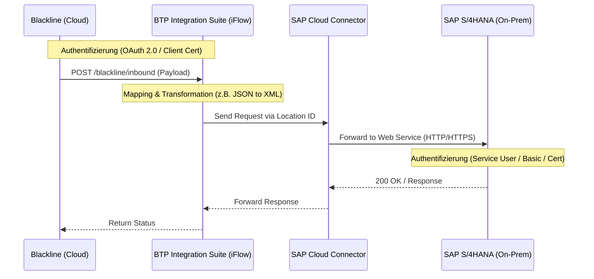

# System Design: Blackline zu SAP S/4HANA (Inbound) via BTP Integration Suite

## Übersicht
Dieses Design beschreibt die Inbound-Schnittstelle von Blackline (Finanzabschluss-Software) zu einem On-Premise SAP S/4HANA System. Die BTP Integration Suite fungiert als Middleware, während der SAP Cloud Connector die sichere Verbindung in das Kundennetzwerk herstellt.

## Architektur (Mermaid)

## Authentifizierung & Sicherheit
### 1. Blackline zu Integration Suite
- Blackline authentifiziert sich gegenüber der IS mittels **OAuth 2.0** (Client Credentials) oder **Client Certificate Authentication**.
- In der IS wird ein Service Key im BTP Cockpit erstellt, um die Credentials für Blackline zu generieren.

### 2. Integration Suite zu S/4HANA (via Cloud Connector)
- Der Cloud Connector stellt einen **Virtual Host** zur Verfügung, der auf den physischen Host des S/4HANA Systems mappt.
- **Authentifizierung am S/4HANA:** Ja, das S/4HANA Framework (Blackline Connector/Web Service) benötigt eine eigene Authentifizierung. 
- **Empfehlung:** Verwendung eines technischen Users (System User) im S/4HANA. Die IS reicht die Credentials (entweder via *Basic Authentication* im HTTP-Header oder via *Principal Propagation*) durch den Cloud Connector an S/4HANA weiter.

## Konfigurations-Schritte
1.  **S/4HANA:** Aktivierung der benötigten Web-Services (SOAP/REST) für das Blackline-Framework. Anlegen eines technischen Users mit den entsprechenden Berechtigungen.
2.  **Cloud Connector:** 
    - Mapping des S/4HANA Hosts (Virtual to Internal).
    - Freigabe der spezifischen URL-Pfade für die Blackline-Webservices.
3.  **Integration Suite:**
    - Erstellen eines iFlows mit einem HTTPS-Sender-Adapter.
    - Implementierung des Mappings (falls Blackline ein anderes Format sendet als S/4HANA erwartet).
    - Konfiguration des HTTP-Receiver-Adapters mit Proxy-Typ "On-Premise" und den Credentials für den S/4HANA User.
4.  **Blackline:** Konfiguration des API-Endpunkts der IS und Hinterlegung der OAuth-Credentials.

## Best Practices
- **Logging:** Implementierung eines detaillierten Error-Loggings in der IS, um Fehler beim Verbuchen im S/4HANA Framework schnell identifizieren zu können.
- **Sicherheit:** Kommunikation durchgehend via HTTPS. Keine direkten Firewall-Öffnungen (dank Cloud Connector).
